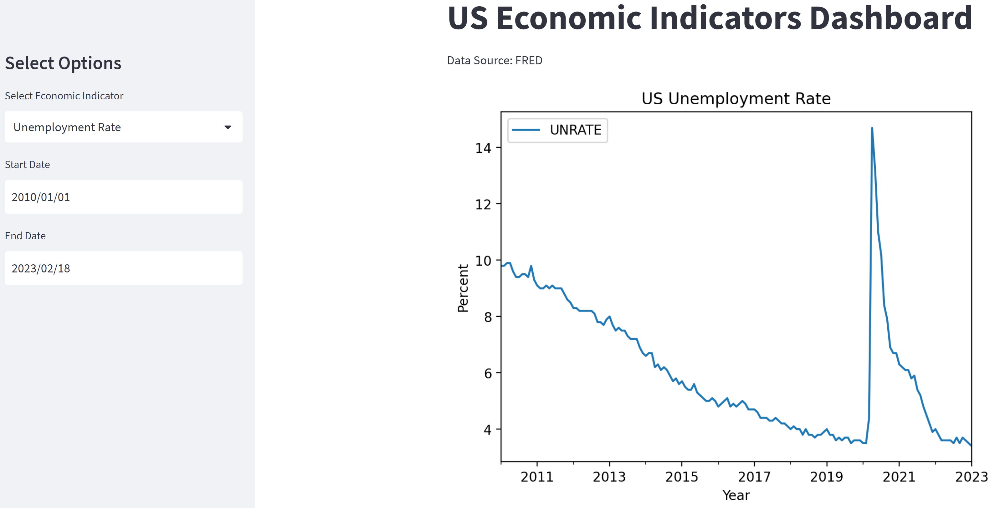

# Interactive Economic KPI Dashboard

## Introduction

This is an interactive KPI dashboard built with Streamlit that allows users to explore key economic indicators for the United States. The dashboard provides visualizations and data for indicators such as Gross Domestic Product (GDP), unemployment rate, inflation rate, and more.

The dashboard is designed to be user-friendly, with intuitive controls that allow users to adjust date ranges and select specific indicators to view. The data is sourced from the Federal Reserve Bank of St. Louis and is updated regularly.

Whether you're a student of economics, a professional in the finance industry, or simply interested in tracking the state of the U.S. economy, this dashboard is a powerful tool for gaining insight into economic trends and indicators. So why not give it a try and explore the data for yourself?

Gross Domestic Product (GDP): GDP is the total value of all goods and services produced within a country's borders in a specific time period. It's often used as a broad measure of a country's economic health and growth.

Consumer Price Index (CPI): The CPI measures changes in the prices of goods and services that consumers buy, and is used as a gauge of inflation. It calculates the percentage change in prices of a basket of goods and services over time.

Unemployment Rate: The unemployment rate is the percentage of the total labor force that is unemployed but actively seeking employment and willing to work. It is often used as an indicator of the health of the labor market and the overall economy.

---

### Requirements
To run the dashboard, you will need the following software:

    - Python 3.6+
    - Streamlit (can be installed via pip)
    - Pandas (can be installed via pip)
    - Plotly (can be installed via pip)
    
---

## Installation
- Clone the repository to your local machine.
- Install the required dependencies using pip: pip install streamlit pandas plotly.
- Run the InteractiveEconomicKPI.py file using the command streamlit run InteractiveEconomicKPI.py.
- Access the dashboard by opening your web browser and navigating to the URL displayed in the terminal (usually http://localhost:8501).

---

## Usage
Upon running the dashboard, you will be presented with a menu of economic indicators to choose from. Select an indicator by clicking on its name, and the dashboard will display various visualizations and statistics related to that indicator. You can customize the visualization by adjusting the date range, data frequency, and chart type using the sidebar on the right.

---
# Higher level overview of project

### Library Imports: 
Import the required libraries.

    import pandas as pd
    import pandas_datareader.data as web
    import streamlit as st
    import matplotlib.pyplot as plt
    import datetime

### Title: 
The dashboard's title is set using the 'st.title' function.

### Sidebar: 
A sidebar is created using the 'st.sidebar.title' function to allow the user to select an economic indicator and a date range. 

The available economic indicators are defined in a list called 'indicators', and a dropdown menu is created using the 'st.sidebar.selectbox' function. 

Date input widgets are also created for selecting the start and end dates.

### Data Retrieval: 
The data is retrieved from FRED using pandas-datareader's 'DataReader' function, which takes the selected economic indicator, start and end dates as input.

### Chart Creation: 
A line chart is created using Plotly Express. The x-axis shows the date and the y-axis shows the selected economic indicator's value. A title is added to the chart showing the selected economic indicator and the start and end dates.

### Moving Average: 
A moving average line is added to the chart using pandas' 'rolling' function. The window size of the moving average is determined by a slider widget in the sidebar.

### Range Slider: 
A range slider is added to the chart to allow the user to zoom in on specific time periods.

### Chart Display: 
The chart is displayed on the dashboard using the 'st.plotly_chart' function. The 'use_container_width=True' parameter is used to make the chart responsive to the width of the container.

---

### Contributing
If you'd like to contribute to this project, please fork the repository and create a pull request with your changes. I welcome contributions of all kinds, whether it's fixing a bug, adding a new feature, or improving the documentation.

---

### License
This project is licensed under the MIT License - see the LICENSE file for details.